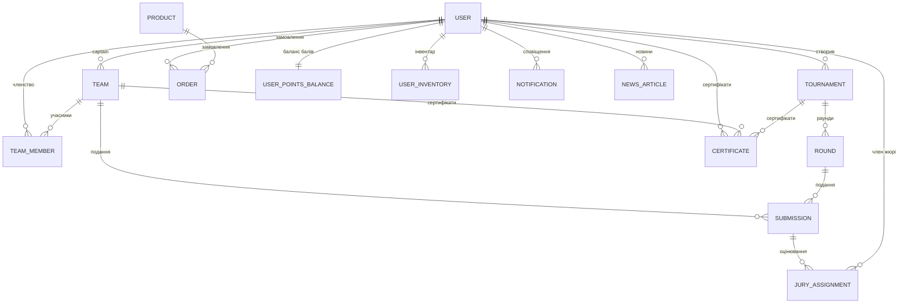
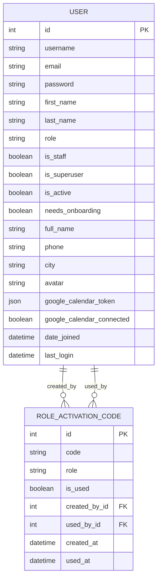
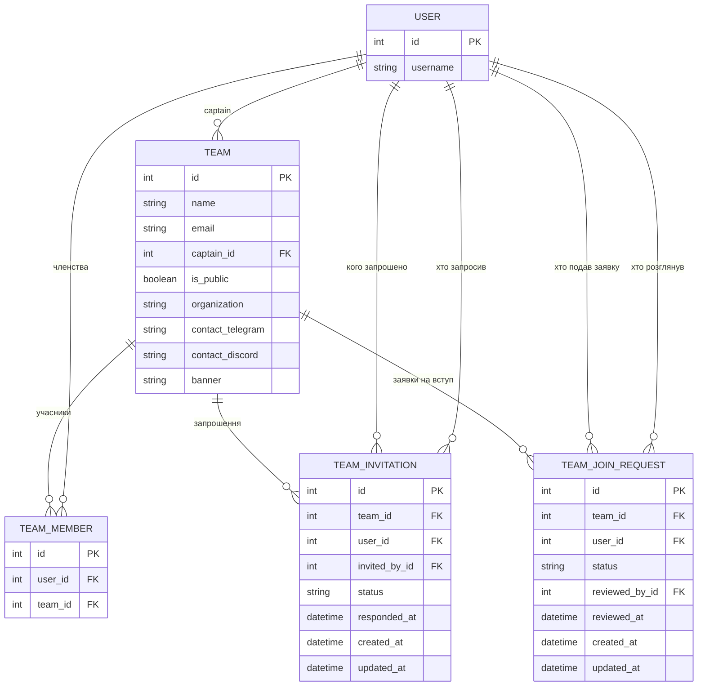
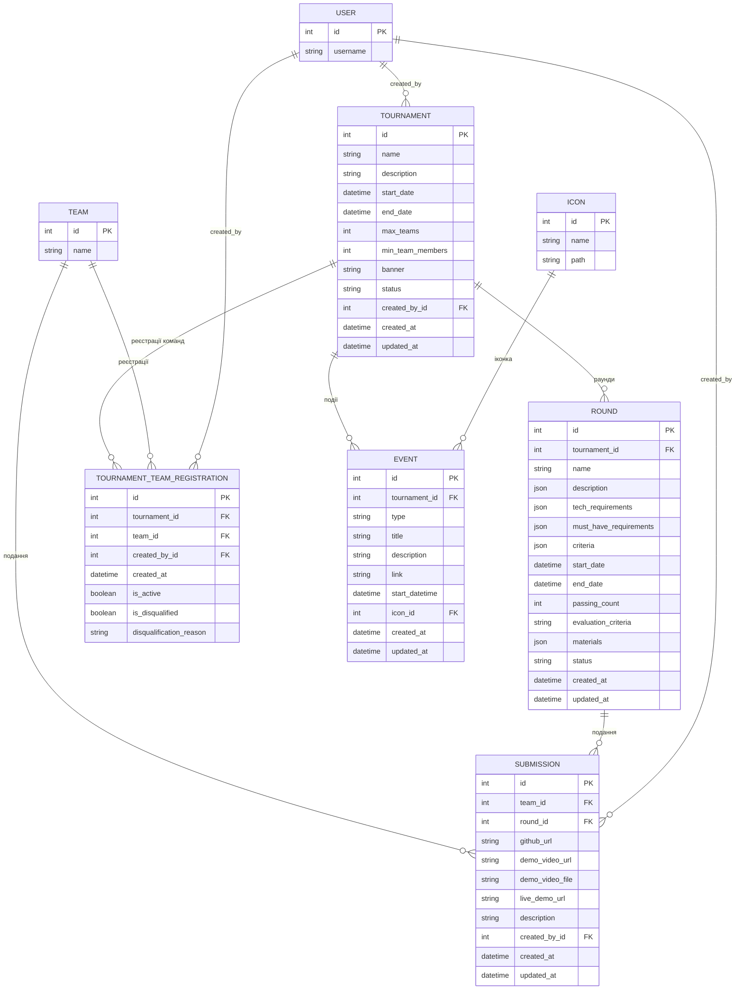
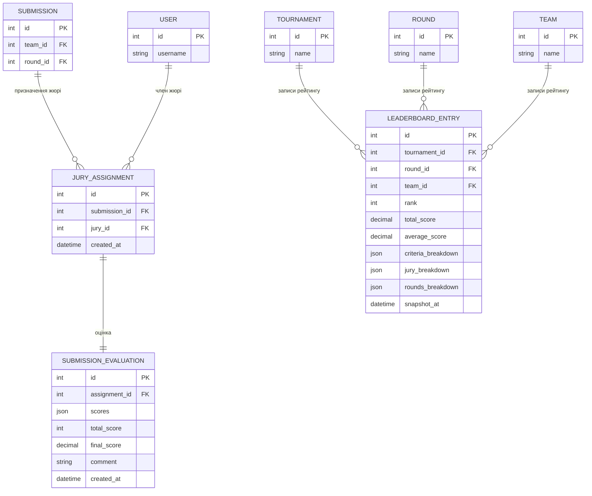
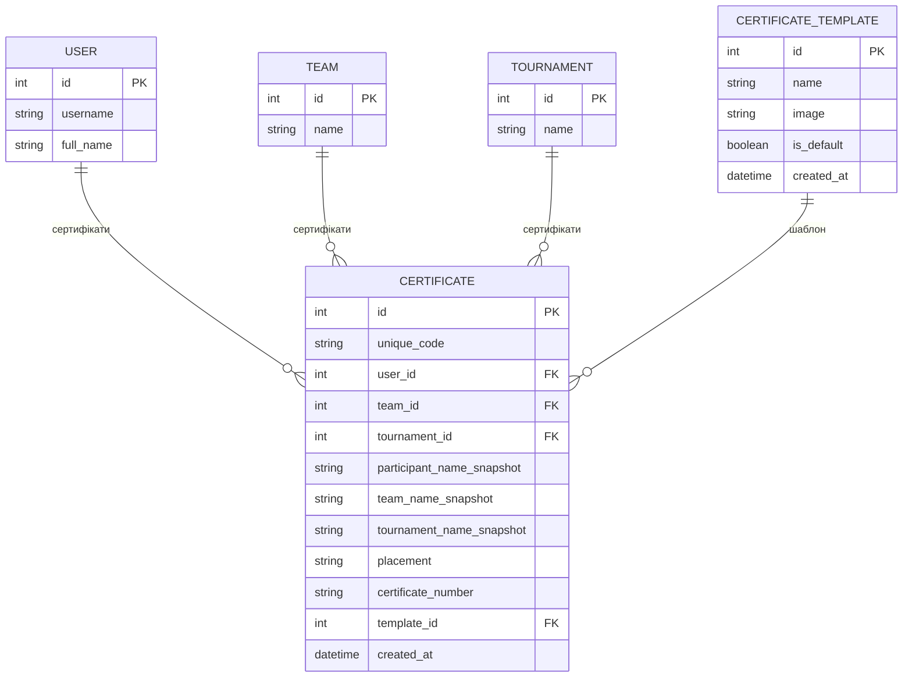
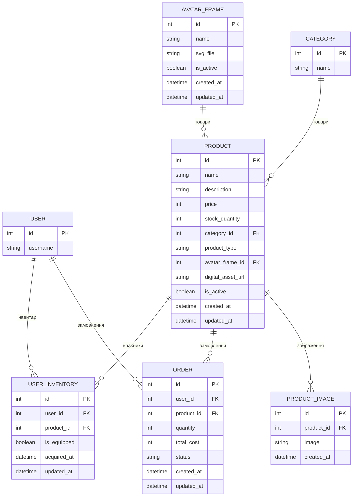
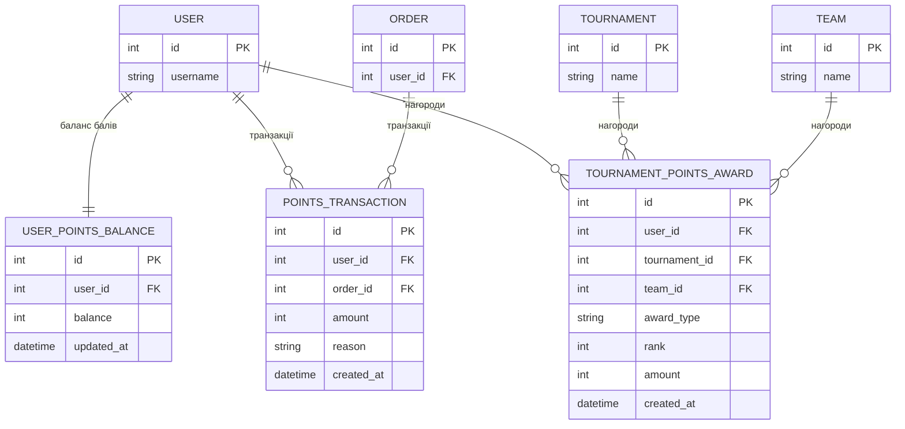
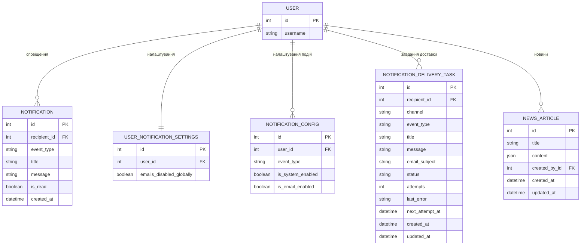

# ER-діаграма бази даних проєкту

Документ містить ER-діаграми (Entity-Relationship), згруповані за модулями Django (apps), щоб кожна діаграма залишалась компактною та читабельною. "Зовнішні" сутності (з інших модулів) показані скорочено — лише `id` та назва — щоб було видно зв'язок без дублювання всіх полів.

---

## Загальна карта зв'язків (огляд)

---

## 1. Акаунти (accounts)

**Примітки:**
- `role` — одне з: `admin`, `team`, `jury`, `organizer`.
- `email` — унікальне поле.
- `ROLE_ACTIVATION_CODE.code` — унікальний, є індекс `(role, is_used)`.
- `created_by_id` / `used_by_id` — обидва nullable (`SET_NULL`).

---

## 2. Команди (teams)

**Примітки:**
- `TEAM.name` — унікальне.
- `TEAM.members` (M2M User ↔ Team) реалізовано через таблицю `TEAM_MEMBER` — `unique(user, team)`.
- `TEAM_INVITATION` — `unique(team, user)`, індекси за `(team, status)` та `(user, status)`.
- `TEAM_JOIN_REQUEST` — `unique(team, user)`, аналогічні індекси.
- `reviewed_by_id` у `TEAM_JOIN_REQUEST` — nullable.

---

## 3. Турніри та подання (tournaments)

**Примітки:**
- `ROUND` — `unique(tournament, start_date)`; також лише один `active`-раунд на турнір (умовний унікальний індекс по `status='active'`).
- `SUBMISSION` — `unique(team, round)`.
- `TOURNAMENT_TEAM_REGISTRATION` — `unique(tournament, team)`.
- `created_by_id` у `TOURNAMENT`, `SUBMISSION`, `TOURNAMENT_TEAM_REGISTRATION` — nullable (`SET_NULL`).
- `EVENT.icon_id` — nullable.

---

## 4. Оцінювання (evaluation)

**Примітки:**
- `JURY_ASSIGNMENT` — `unique(submission, jury)`.
- `SUBMISSION_EVALUATION.assignment_id` — `OneToOne` до `JURY_ASSIGNMENT` (одна оцінка на одне призначення).
- `total_score` та `final_score` обчислюються автоматично з `scores` при збереженні.
- `LEADERBOARD_ENTRY` — `unique(tournament, round, team)`; `round_id` та `jury_breakdown`/`rounds_breakdown` — nullable.

---

## 5. Сертифікати (certificates)

**Примітки:**
- `CERTIFICATE.unique_code` — унікальний UUID.
- `user_id`, `team_id`, `tournament_id`, `template_id` — усі nullable (`SET_NULL`); назви/учасники "заморожуються" у полях `*_name_snapshot` на момент створення.
- `CERTIFICATE_TEMPLATE` — лише один шаблон може мати `is_default = true` (забезпечується при збереженні).

---

## 6. Магазин та інвентар (shop, inventory)

**Примітки:**
- `CATEGORY.name` — унікальне; видалення категорії захищене (`PROTECT`), якщо є товари.
- `PRODUCT.product_type` — `physical` або `digital`; `avatar_frame_id` — nullable, лише для активних рамок.
- `digital_asset_url` — застаріле поле (deprecated), залишене для сумісності; реальний URL обчислюється через `effective_digital_asset_url`.
- `USER_INVENTORY` — `unique(user, product)`, товар має бути `digital`.
- Індекси `ORDER`: `(user, -created_at)`, `(status, -created_at)`.

---

## 7. Бали (points)

**Примітки:**
- `USER_POINTS_BALANCE.user_id` — `OneToOne`, по одному балансу на користувача.
- `POINTS_TRANSACTION.order_id` — nullable (`SET_NULL`); індекси `(user, -created_at)` та `(user, amount)`.
- `TOURNAMENT_POINTS_AWARD` — `award_type` ∈ {`participation`, `placement`}; `unique(user, tournament, award_type)`; `team_id` — nullable.

---

## 8. Сповіщення та новини (notifications, news)

**Примітки:**
- `NOTIFICATION` — індекси `(recipient, is_read)`, `(recipient, created_at)`.
- `USER_NOTIFICATION_SETTINGS.user_id` — `OneToOne` (глобальне вимкнення email).
- `NOTIFICATION_CONFIG` — `unique(user, event_type)` (системні/email-сповіщення для конкретного типу події).
- `NOTIFICATION_DELIVERY_TASK.status` ∈ {`pending`, `processing`, `sent`, `failed`}; індекси `(status, next_attempt_at)`, `(recipient, created_at)`.
- `NEWS_ARTICLE.created_by_id` — nullable (`SET_NULL`); `content` — JSON-об'єкт (валідується, що саме dict).

---

## Підсумок: модулі та кількість сутностей

| Модуль (Django app) | Сутності |
|---|---|
| accounts | User, RoleActivationCode |
| teams | Team, TeamMember, TeamInvitation, TeamJoinRequest |
| tournaments | Tournament, Round, Submission, TournamentTeamRegistration, Icon, Event |
| evaluation | JuryAssignment, SubmissionEvaluation, LeaderboardEntry |
| certificates | CertificateTemplate, Certificate |
| shop | Category, AvatarFrame, Product, ProductImage, Order |
| inventory | UserInventory |
| points | UserPointsBalance, PointsTransaction, TournamentPointsAward |
| notifications | Notification, UserNotificationSettings, NotificationConfig, NotificationDeliveryTask |
| news | NewsArticle |

Усього: **31 сутність** у 10 модулях. `User` — центральна сутність, з якою пов'язана більшість інших таблиць.
